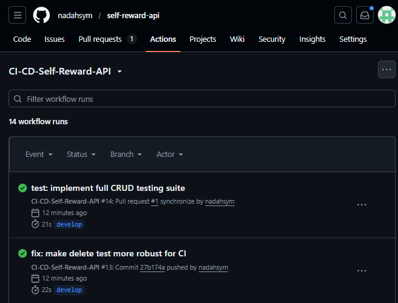

# 🚀 Self-Reward Planner API

## 1. Deskripsi Project
**Self-Reward Planner API** adalah RESTful API menggunakan **FastAPI** untuk mengelola daftar "hadiah" (*rewards*) sebagai apresiasi diri. Fitur utama: CRUD reward dan *Random Suggestion*.

---

## 2. Dokumentasi API
Akses Swagger UI di: `http://localhost:8000/docs`

| Method | Endpoint | Keterangan |
| :--- | :--- | :--- |
| `GET` | `/rewards` | Ambil semua daftar reward. |
| `POST` | `/rewards` | Tambah reward (Query: `id`, `name`, `points`). |
| `PUT` | `/rewards/{id}` | Update reward berdasarkan ID. |
| `DELETE` | `/rewards/{id}` | Hapus reward berdasarkan ID. |
| `GET` | `/suggestion` | Rekomendasi reward acak. |

**Format Response (JSON Success):**
`{ "status": "reward added", "data": { "id": 1, "name": "Kopi", "points": 10 } }`

---

## 3. Panduan Instalasi (Docker)
1. Pastikan **Docker Desktop** aktif.
2. Jalankan: `docker-compose up --build`
3. Akses di: `http://localhost:8000`
**Port:** Host `8000` | Container `8000`

---

## 4. Alur Kerja Git
* **Branching:** `main` (stabil), `develop` (integrasi), `feature/` (fitur baru).
* **Conventional Commits:** `feat:` (fitur), `fix:` (bug), `test:` (unit test), `ci:` (GitHub Actions).

---

## 5. Status Automasi (GitHub Actions)
1. **CI (Continuous Integration):** Unit testing otomatis menggunakan `Pytest`.
2. **CS (Continuous Security):** Security scanning menggunakan `Bandit`.

---
**Dibuat oleh:** Nada Ghaisani Hasyim (140810230052)
*Teknik Informatika, Universitas Padjadjaran*